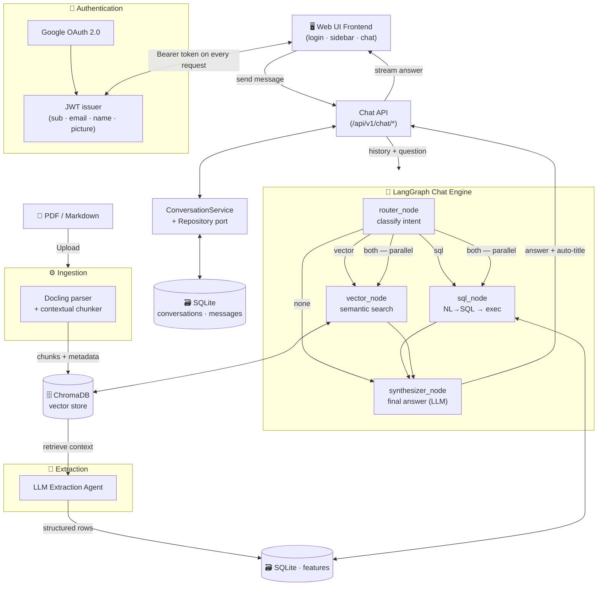
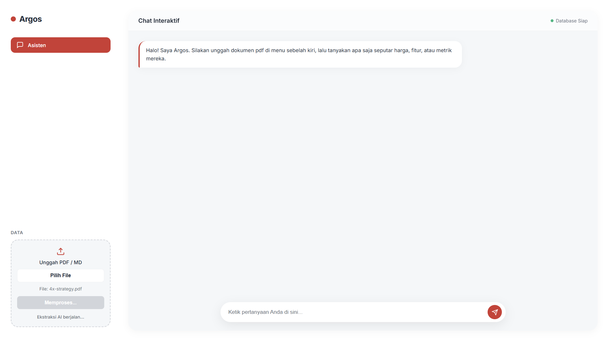
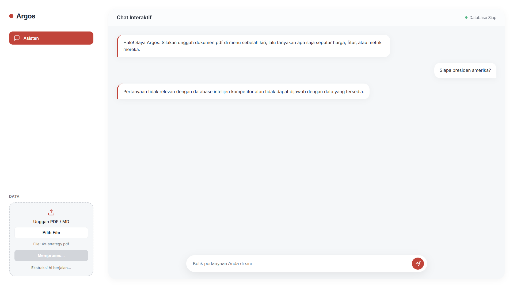
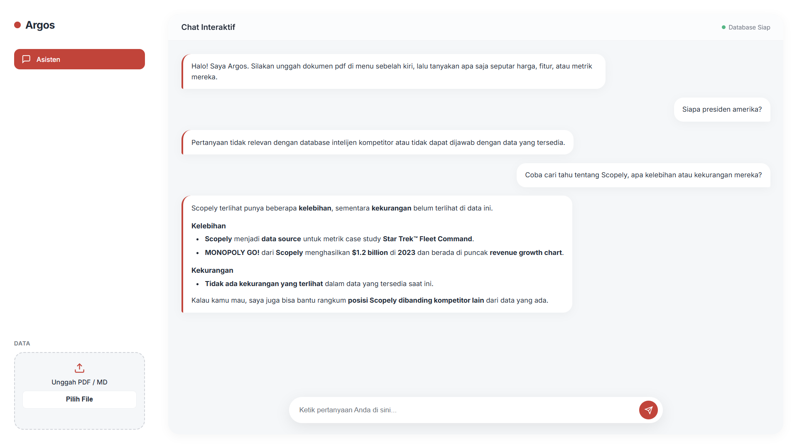

# ArgosAI — Competitive Intelligence System

*Technical Documentation & User Guide*

---

## 1. Overview

ArgosAI is an AI-powered competitive intelligence system that enables users to upload competitor documents (PDF or Markdown), automatically extract structured data using an LLM, and perform natural language Q&A against that competitor data.

The system is designed for **product**, **strategy**, and **business intelligence** teams who want to gain competitive insights quickly — without manually reading lengthy documents.

---

## 2. System Architecture

ArgosAI is built around four interconnected flows: **authentication**, **document ingestion + extraction**, **multi-conversation chat**, and a **hybrid retrieval graph** that routes each question to SQL, vector search, or both.



### Component Explanation

- **Authentication.** Users sign in with **Google OAuth 2.0**; the backend issues a **JWT** containing `sub`, `email`, `name`, `given_name`, and `picture`. Every API request must carry the token, and all data is scoped per `user_id`.
- **Ingestion.** Uploaded **PDF / Markdown** documents are parsed by **Docling**, split into chunks with contextual metadata, and embedded into **ChromaDB**.
- **Extraction.** An **LLM agent** reads the document via ChromaDB and writes structured rows (`competitor_name`, `feature_name`, `price`, `advantages`, `disadvantages`) into the `features` table in SQLite.
- **Conversation persistence.** The `Chat API` talks to a `ConversationService` backed by a **repository port** (SQLite adapter today, swappable later). Each user owns multiple conversations; each conversation owns an ordered list of messages. Titles are generated automatically from the first message via a small LLM call.
- **Hybrid retrieval graph.** Built with **LangGraph**: a `router_node` classifies the question into `sql`, `vector`, `both`, or `none`. `sql_node` runs an NL→SQL → safe-execute pipeline against `features`. `vector_node` performs semantic search on ChromaDB. Their outputs are merged by `synthesizer_node`, which produces the final natural-language answer in the user's language.

---

## 3. Running with Docker

### Prerequisites

- **Docker Desktop** installed and running
- **OpenAI API Key**

### Step 1 — Prepare the `.env` file

Create a `.env` file in the project root directory (same level as `docker-compose.yml`):

```env
OPENAI_API_KEY=""
```

> ⚠️ Never commit the `.env` file to your repository. Make sure `.env` is included in `.gitignore`.

### Step 2 — Build and run the container

```bash
docker-compose up --build
```

This command will build the image, install all dependencies, and start the FastAPI server on port 8000.

### Step 3 — Access the application

Once the container is running, open your browser and go to:

```
http://localhost:8000
```

### Other Docker Commands

| Command | Description |
|---|---|
| `docker-compose up --build` | Rebuild image and run (first time / after code changes) |
| `docker-compose up -d` | Run in background (detached mode) |
| `docker-compose down` | Stop and remove containers |
| `docker-compose logs -f` | View real-time logs |

---

## 4. Reliability Test

The test was conducted by asking the same question **3 times consecutively** to observe the consistency of the generated SQL and the accuracy of the AI's answers. The test was run in two prompt languages: **Bahasa Indonesia** and **English**.

---

### Table A — Indonesian Prompt (3 Attempts)

*Prompt: "Coba cari tahu tentang Scopely, apa kelebihan atau kekurangan mereka?"*

| Attempt | Generated SQL | AI Answer (Summary) |
|---|---|---|
| #1 | `SELECT competitor_name, feature_name, advantages, disadvantages FROM features WHERE competitor_name LIKE '%Scopely%' OR feature_name LIKE '%Scopely%' ORDER BY competitor_name, feature_name;` | Scopely unggul sebagai data source Star Trek™ Fleet Command dan MONOPOLY GO! raih $1.2B di 2023. Tidak ada kekurangan tercantum. |
| #2 | `SELECT competitor_name, feature_name, advantages, disadvantages FROM features WHERE competitor_name LIKE '%Scopely%' OR feature_name LIKE '%Scopely%' ORDER BY competitor_name, feature_name` | MONOPOLY GO! menduduki puncak growth chart revenue 2023 ($1.2B). Scopely juga menjadi basis data case study. Kekurangan: tidak terlihat. |
| #3 | `SELECT competitor_name, feature_name, advantages, disadvantages FROM features WHERE competitor_name LIKE '%Scopely%' OR feature_name LIKE '%Scopely%' ORDER BY competitor_name, feature_name` | Dua kelebihan utama: revenue leadership (MONOPOLY GO! $1.2B) dan data source attribution. Kekurangan tidak tercantum di data. |

### Table B — English Prompt (3 Attempts)

*Prompt: "Find out about Scopely, what are their strengths and weaknesses?"*

| Attempt | Generated SQL | AI Answer (Summary) |
|---|---|---|
| #1 | `SELECT competitor_name, feature_name, advantages, disadvantages FROM features WHERE competitor_name LIKE '%Scopely%' OR feature_name LIKE '%Scopely%' ORDER BY competitor_name, feature_name;` | Two strengths: data source for Star Trek™ case study + MONOPOLY GO! revenue $1.2B topped 2023 chart. No weaknesses visible. |
| #2 | `SELECT competitor_name, feature_name, advantages, disadvantages FROM features WHERE competitor_name LIKE '%Scopely%' OR feature_name LIKE '%Scopely%' ORDER BY competitor_name, feature_name;` | Scopely shows two clear strengths. MONOPOLY GO! generated $1.2B in 2023 and topped the revenue growth chart. No weaknesses shown. |
| #3 | `SELECT competitor_name, feature_name, advantages, disadvantages FROM features WHERE competitor_name LIKE '%Scopely%' OR feature_name LIKE '%Scopely%' ORDER BY competitor_name, feature_name` | Strengths: data source attribution + MONOPOLY GO! $1.2B revenue leadership 2023. Weaknesses: none visible in current data. |

### Reliability Test Conclusions

- **Consistent SQL:** All 6 attempts produced identical SQL queries with the same `WHERE`, `ORDER BY`, and column selections.
- **Accurate language detection:** The system responded in the same language as the user's question without any additional configuration.
- **Consistent content:** Key facts (MONOPOLY GO! $1.2B, Star Trek™ data source attribution) appeared in every answer.
- **Natural variation:** Sentence structure varied slightly between attempts, demonstrating generative responses rather than static templates.

---

## 5. Limitations

The following are limitations of the ArgosAI system that should be understood before using it in a production context.

### Data & Ingestion

- Answer quality is entirely dependent on the quality of the uploaded documents. Ambiguous, incomplete, or unstructured data will result in less accurate extractions.
- The system only supports **PDF** and **Markdown** formats. Other formats such as DOCX, XLSX, or standalone images are not yet supported.

### AI & Accuracy

- The LLM may generate suboptimal SQL queries for very complex or ambiguous questions, although the security system blocks destructive queries.

### Infrastructure

- **SQLite is not suitable for high-concurrency writes.** For large-scale multi-user usage, migrating to PostgreSQL is strongly advised.
- **OpenAI API costs are per-request.** Each question can trigger several API calls along the LangGraph pipeline (router → SQL and/or vector → synthesizer, plus an auto-title call on the first turn), so operational costs should be monitored for intensive usage.

---

## 6. Screenshots

<div align="center">

  
  <p><i>Chat interface showing a natural language query and structured AI response about competitor data</i></p>

  <br/>

  
  <p><i>Document upload panel with AI extraction processing in progress</i></p>

  <br/>

  
  <p><i>Initial state — ready to receive competitor documents via the upload panel</i></p>

</div>

---

*ArgosAI — Built with FastAPI · LangGraph · LangChain · ChromaDB · SQLite · Google OAuth · OpenAI*
