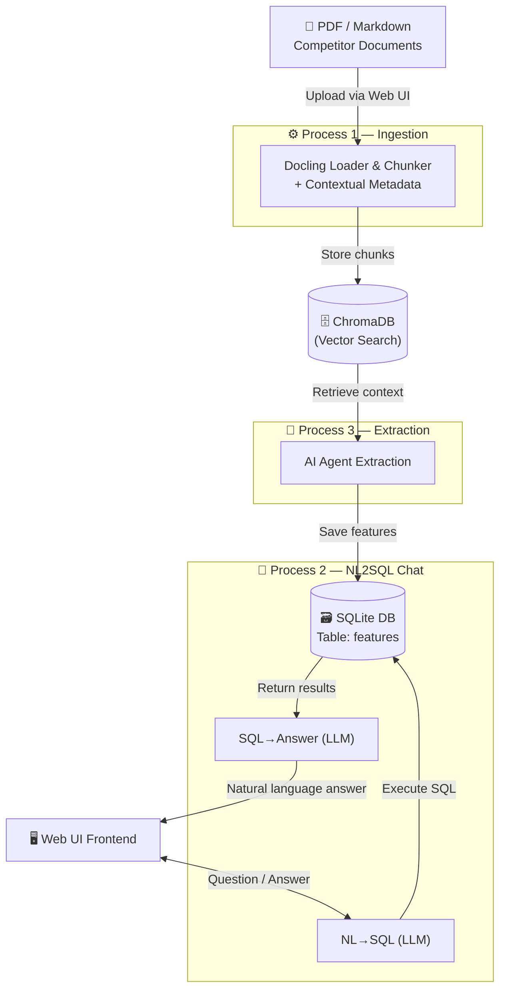

# ArgosAI — Competitive Intelligence System

*Technical Documentation & User Guide*

---

## 1. Overview

ArgosAI is an AI-powered competitive intelligence system that enables users to upload competitor documents (PDF or Markdown), automatically extract structured data using an LLM, and perform natural language Q&A against that competitor data.

The system is designed for **product**, **strategy**, and **business intelligence** teams who want to gain competitive insights quickly — without manually reading lengthy documents.

---

## 2. System Architecture

ArgosAI consists of three main interconnected processes: document ingestion, AI extraction, and NL2SQL-based chat.



### Component Explanation

- **Data Source:** PDF or Markdown documents containing competitor data are uploaded through the Web UI.
- **Process 1 — Ingestion:** Docling reads and parses the document, splits text into chunks with contextual metadata, then stores them in ChromaDB.
- **Process 3 — Extraction:** The AI Agent reads the entire document via ChromaDB and extracts competitor features (pricing, advantages, disadvantages) into the `features` table in SQLite.
- **Process 2 — NL2SQL Chat:** The user's question is translated by the LLM into a SQL query, executed against SQLite, and the result is summarized back into a natural language answer by the LLM.

---

## 3. Running with Docker

### Prerequisites

- **Docker Desktop** installed and running
- **OpenAI API Key**

### Step 1 — Prepare the `.env` file

Create a `.env` file in the project root directory (same level as `docker-compose.yml`):

```env
OPENAI_API_KEY=sk-proj-xxxxxxxxxxxxxxxxxxxxxxxx
```

> ⚠️ Never commit the `.env` file to your repository. Make sure `.env` is included in `.gitignore`.

### Step 2 — Ensure the database file exists

If `argos.db` does not exist yet, create it first so the Docker volume can be mounted properly:

```bash
# Windows PowerShell
New-Item -ItemType File argos.db

# Mac / Linux
touch argos.db
```

> 📌 The file `argos.db` on your host machine will be mounted as `competitor_data.db` inside the container.

### Step 3 — Build and run the container

```bash
docker-compose up --build
```

This command will build the image, install all dependencies, and start the FastAPI server on port 8000.

### Step 4 — Access the application

Once the container is running, open your browser and go to:

```
http://localhost:8000
```

### Other Docker Commands

| Command | Description |
|---|---|
| `docker-compose up --build` | Rebuild image and run (first time / after code changes) |
| `docker-compose up -d` | Run in background (detached mode) |
| `docker-compose down` | Stop and remove containers |
| `docker-compose logs -f` | View real-time logs |

---

## 4. Reliability Test

The test was conducted by asking the same question **3 times consecutively** to observe the consistency of the generated SQL and the accuracy of the AI's answers. The test was run in two prompt languages: **Bahasa Indonesia** and **English**.

---

### Table A — Indonesian Prompt (3 Attempts)

*Prompt language: Bahasa Indonesia — "Coba cari tahu tentang Scopely, apa kelebihan atau kekurangan mereka?"*

---

#### Attempt #1

**Generated SQL:**
```sql
SELECT competitor_name, feature_name, advantages, disadvantages FROM features WHERE competitor_name LIKE '%Scopely%' OR feature_name LIKE '%Scopely%' ORDER BY competitor_name, feature_name;
```

**AI Answer:**

**Scopely** terlihat punya beberapa **kelebihan** di data ini, tetapi **tidak ada kekurangan** yang ditampilkan.

##### Kelebihan
- **Data source attribution**: menjadi dasar data untuk metrik studi kasus **Star Trek™ Fleet Command**.
- **Revenue Growth Leadership 2023**: **MONOPOLY GO!** menghasilkan **$1.2 billion** pada **2023** dan berada di puncak chart pertumbuhan revenue.

##### Kekurangan
- **Tidak terlihat** ada kekurangan yang tercantum di data saat ini.

Kalau kamu mau, saya juga bisa bantu rangkum **Scopely** dalam versi yang lebih singkat atau fokus ke **performance** mereka saja.

---

#### Attempt #2

**Generated SQL:**
```sql
SELECT competitor_name, feature_name, advantages, disadvantages FROM features WHERE competitor_name LIKE '%Scopely%' OR feature_name LIKE '%Scopely%' ORDER BY competitor_name, feature_name
```

**AI Answer:**

Scopely terlihat punya **kelebihan** yang cukup jelas di data ini, sementara **kekurangan**-nya tidak terlihat.

##### Kelebihan
- **MONOPOLY GO!** menghasilkan **$1.2 billion** pada **2023** dan **menduduki puncak chart pertumbuhan revenue**.
- Scopely juga tercatat sebagai **sumber data** yang menjadi dasar metrik **Star Trek™ Fleet Command** case study.

##### Kekurangan
- **Tidak ada kekurangan yang tercantum** dalam data yang tersedia saat ini.

Jadi, dari data ini Scopely terlihat kuat di sisi **pertumbuhan revenue** dan juga berperan sebagai **data source** untuk case study yang ditampilkan.

---

#### Attempt #3

**Generated SQL:**
```sql
SELECT competitor_name, feature_name, advantages, disadvantages FROM features WHERE competitor_name LIKE '%Scopely%' OR feature_name LIKE '%Scopely%' ORDER BY competitor_name, feature_name
```

**AI Answer:**

**Scopely** terlihat punya beberapa **kelebihan** di data yang ada, sementara **kekurangan** tidak terlihat disebutkan.

##### Kelebihan
- **MONOPOLY GO!** menghasilkan **$1.2 billion** pada **2023** dan **memimpin growth chart pendapatan**.
- Scopely juga menjadi **data source** untuk metrik studi kasus **Star Trek™ Fleet Command**.

##### Kekurangan
- **Tidak ada kekurangan yang terlihat** di data saat ini.

Kalau kamu mau, saya juga bisa bantu rangkum **Scopely** dalam versi singkat, atau bandingkan dengan kompetitor lain jika ada datanya.

---

### Table B — English Prompt (3 Attempts)

*Prompt language: English — "Find out about Scopely, what are their strengths and weaknesses?"*

---

#### Attempt #1

**Generated SQL:**
```sql
SELECT competitor_name, feature_name, advantages, disadvantages
FROM features
WHERE competitor_name LIKE '%Scopely%' OR feature_name LIKE '%Scopely%'
ORDER BY competitor_name, feature_name;
```

**AI Answer:**

**Scopely** shows two clear strengths in the current data, but no weaknesses are visible.

##### Strengths

- **Data source attribution**: Scopely provided the data basis for the **Star Trek™ Fleet Command** case study metrics.
- **Revenue Growth Leadership 2023**: **MONOPOLY GO!** generated **$1.2 billion** in **2023** and topped the revenue growth chart.

##### Weaknesses

- No weaknesses are shown in the current data.

---

#### Attempt #2

**Generated SQL:**
```sql
SELECT competitor_name, feature_name, advantages, disadvantages
FROM features
WHERE competitor_name LIKE '%Scopely%' OR feature_name LIKE '%Scopely%'
ORDER BY competitor_name, feature_name;
```

**AI Answer:**

**Scopely** shows two clear strengths in the current data: it served as the **data source** for the **Star Trek™ Fleet Command** case study metrics, and **MONOPOLY GO!** generated **$1.2 billion** in **2023** and **topped the revenue growth chart**.

##### Strengths

- **Data source attribution**: Provided the data basis for the **Star Trek™ Fleet Command** case study metrics.
- **Revenue Growth Leadership 2023**: **MONOPOLY GO!** generated **$1.2 billion** in **2023** and topped the revenue growth chart.

##### Weaknesses

- No weaknesses are visible in the current data.

---

#### Attempt #3

**Generated SQL:**
```sql
SELECT competitor_name, feature_name, advantages, disadvantages
FROM features
WHERE competitor_name LIKE '%Scopely%' OR feature_name LIKE '%Scopely%'
ORDER BY competitor_name, feature_name
```

**AI Answer:**

**Scopely** shows two clear strengths in the current data, and **no weaknesses are visible**.

##### Strengths

- **Data source attribution**: Scopely provided the data basis for the **Star Trek™ Fleet Command** case study metrics.
- **Revenue Growth Leadership 2023**: **MONOPOLY GO!** generated **$1.2 billion** in **2023** and topped the revenue growth chart.

##### Weaknesses

- **No disadvantages are shown** in the current data.

If you want, I can also summarize this into a shorter competitor snapshot.

---

### Reliability Test Conclusions

- **Consistent SQL:** All 6 attempts produced identical SQL queries with the same `WHERE`, `ORDER BY`, and column selections.
- **Accurate language detection:** The system responded in the same language as the user's question without any additional configuration.
- **Consistent content:** Key facts (MONOPOLY GO! $1.2B, Star Trek™ data source attribution) appeared in every answer.
- **Natural variation:** Sentence structure varied slightly between attempts, demonstrating generative responses rather than static templates.

## 5. Limitations

The following are limitations of the ArgosAI system that should be understood before using it in a production context.

### Data & Ingestion

- Answer quality is entirely dependent on the quality of the uploaded documents. Ambiguous, incomplete, or unstructured data will result in less accurate extractions.
- The system only supports **PDF** and **Markdown** formats. Other formats such as DOCX, XLSX, or standalone images are not yet supported.
- Data is limited to a maximum of **100 rows per query** (`MAX_RAW_ROWS=100`) to prevent context overflow to the LLM.

### AI & Accuracy

- The LLM may generate suboptimal SQL queries for very complex or ambiguous questions, although the security system blocks destructive queries.
- **ArgosAI currently does not use conversation memory.** Every chat message is processed independently — there is no context carried over from previous messages. Each question is treated as a completely new and isolated interaction.
- Answers are bounded by data in SQLite. The LLM will not inject knowledge from outside the database, by design.

### Infrastructure

- **No user authentication.** The system currently has no login or access management mechanism, so public deployment is not recommended without an additional security layer.
- **SQLite is not suitable for high-concurrency writes.** For large-scale multi-user usage, migrating to PostgreSQL is strongly advised.
- **OpenAI API costs are per-request.** Each question triggers two API calls (NL→SQL and SQL→Answer), so operational costs should be monitored for intensive usage.

---

*ArgosAI — Built with LangChain · FastAPI · ChromaDB · SQLite · OpenAI*
```
